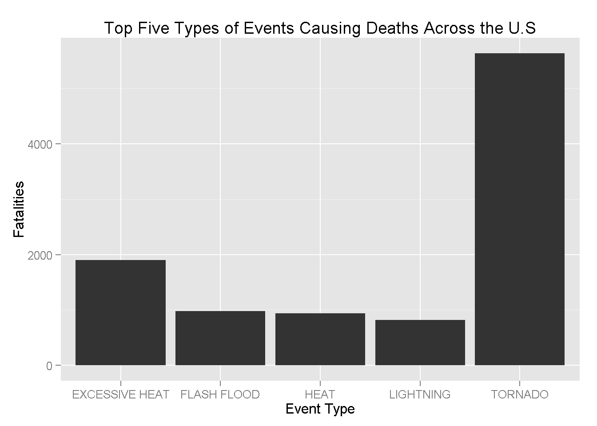
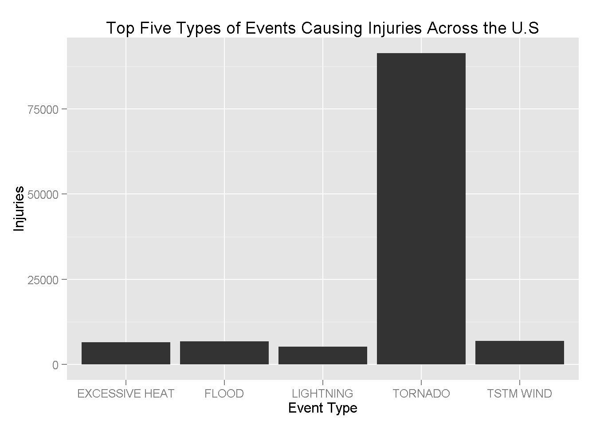
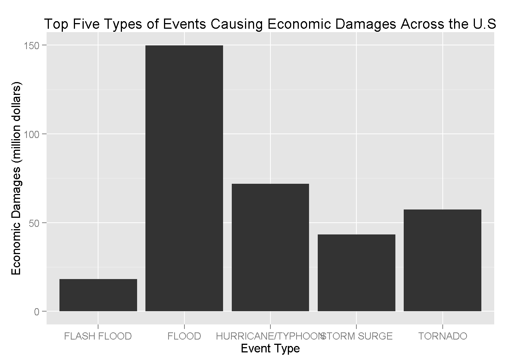

#Tornadoes and Floods Most Harmful Events in the U.S.

##Synopsis

The basic goal of this assignment is to explore the U.S. National Oceanic and Atmospheric Administration's (NOAA) storm database and answer two basic questions about severe weather events, starting in the year 1950 and ending in November 2011.

1.Across the United States, which types of events (as indicated in the EVTYPE variable) are most harmful with respect to population health?

2.Across the United States, which types of events have the greatest economic consequences?

The final results suggest the following:  with respect to poulation health, tornados are most harmful having caused 5633 deaths and 91346 injuries.  With respect to economic impact, floods are the worst, having caused 150 billion dollars economic losses.

##Data Processing

```{r}
library(ggplot2)
library(car)
stormData<-read.csv("repdata-data-StormData.csv",header=TRUE,sep=",")
paste("There are ",dim(stormData)[1]," variables and ",dim(stormData)[2]," observations",sep="")
names(stormData)
head(stormData)
``` 


##Results
1. Across the United States, which types of events (as indicated in the EVTYPE variable) are most harmful with respect to population health?

Population health can be impacted in two ways: fatalities and injuries.  We will aggregate the data by both measures 

```{r}
fatSum <- aggregate(FATALITIES ~ EVTYPE, data = stormData, sum)
fatSum<-fatSum[order(fatSum$FATALITIES, decreasing = T), ]
head(fatSum)

injSum <- aggregate(INJURIES ~ EVTYPE, data = stormData, sum)
injSum <- injSum[order(injSum$INJURIES, decreasing = T), ]
head(injSum)
```

Now we will plot the data by total fatalities and injuries

```{r}
ggplot(fatSum[1:5, ], aes(EVTYPE, FATALITIES)) + geom_bar(stat = "identity") + 
    ylab("Fatalities") + xlab("Event Type") + ggtitle("Top Five Types of Events Causing Deaths Across the U.S")

ggplot(injSum[1:5, ], aes(EVTYPE, INJURIES)) + geom_bar(stat = "identity") + 
    ylab("Injuries") + xlab("Event Type") + ggtitle("Top Five Types of Events Causing Injuries Across the U.S")
```




2. Across the United States, which types of events have the greatest economic consequences?

```{r}
#We recode the storm data to get raw integers for each economic impact
stormData$PROPDMG <- stormData$PROPDMG * as.numeric(Recode(stormData$PROPDMGEXP, 
    "'0'=1;'1'=10;'2'=100;'3'=1000;'4'=10000;'5'=100000;'6'=1000000;'7'=10000000;'8'=100000000;'B'=1000000000;'h'=100;'H'=100;'K'=1000;'m'=1000000;'M'=1000000;'-'=0;'?'=0;'+'=0", 
    as.factor.result = FALSE))
stormData$CROPDMG <- stormData$CROPDMG * as.numeric(Recode(stormData$CROPDMGEXP, 
    "'0'=1;'2'=100;'B'=1000000000;'k'=1000;'K'=1000;'m'=1000000;'M'=1000000;''=0;'?'=0", 
    as.factor.result = FALSE))

totalCost <- aggregate(PROPDMG + CROPDMG ~ EVTYPE, stormData, sum)
totalCost <- totalCost[order(totalCost$"PROPDMG + CROPDMG", decreasing = T), ]
#Convert to Billions
totalCost[, 2] <- totalCost[, 2]/1e+09
names(totalCost) <- c("evtype", "dmg")
```

Graph data using GGplot

```{r}
ggplot(totalCost[1:5, ], aes(evtype, dmg)) + geom_bar(stat = "identity") + ylab("Economic Damages (million dollars)") + 
    xlab("Event Type") + ggtitle("Top Five Types of Events Causing Economic Damages Across the U.S")
```




Floods cause the most economic damage in the United States.
